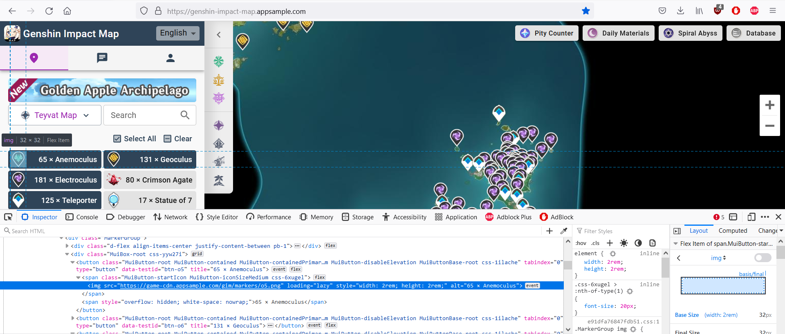
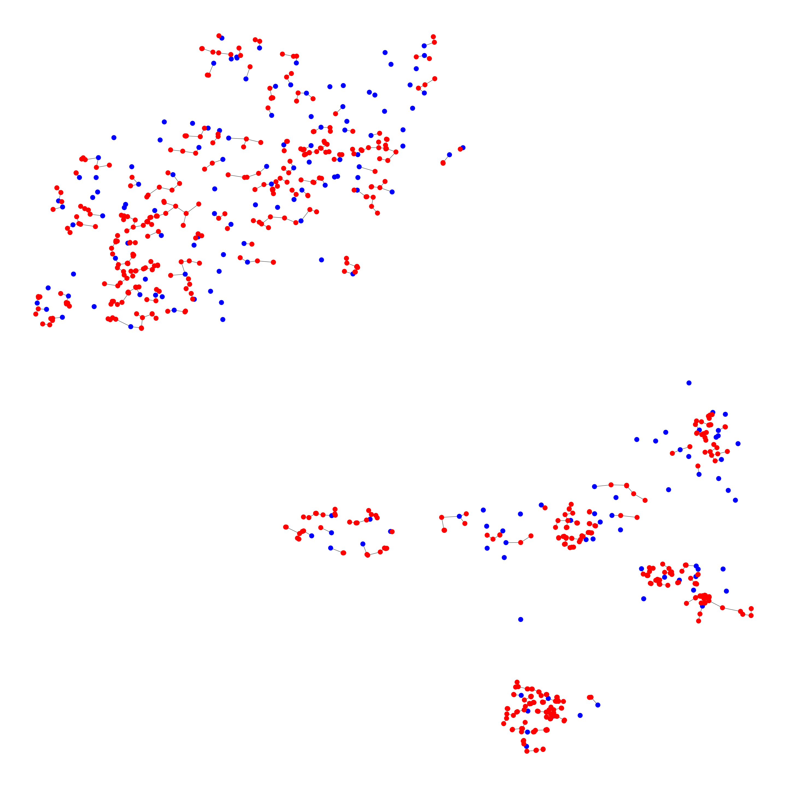
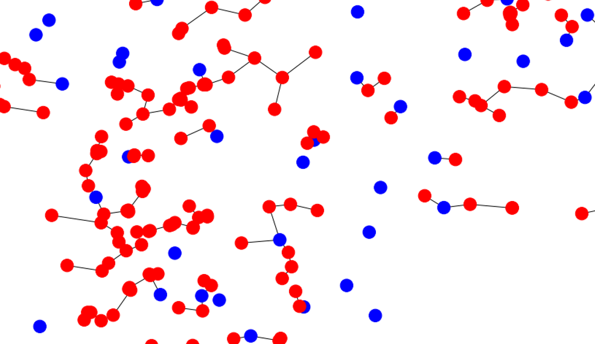
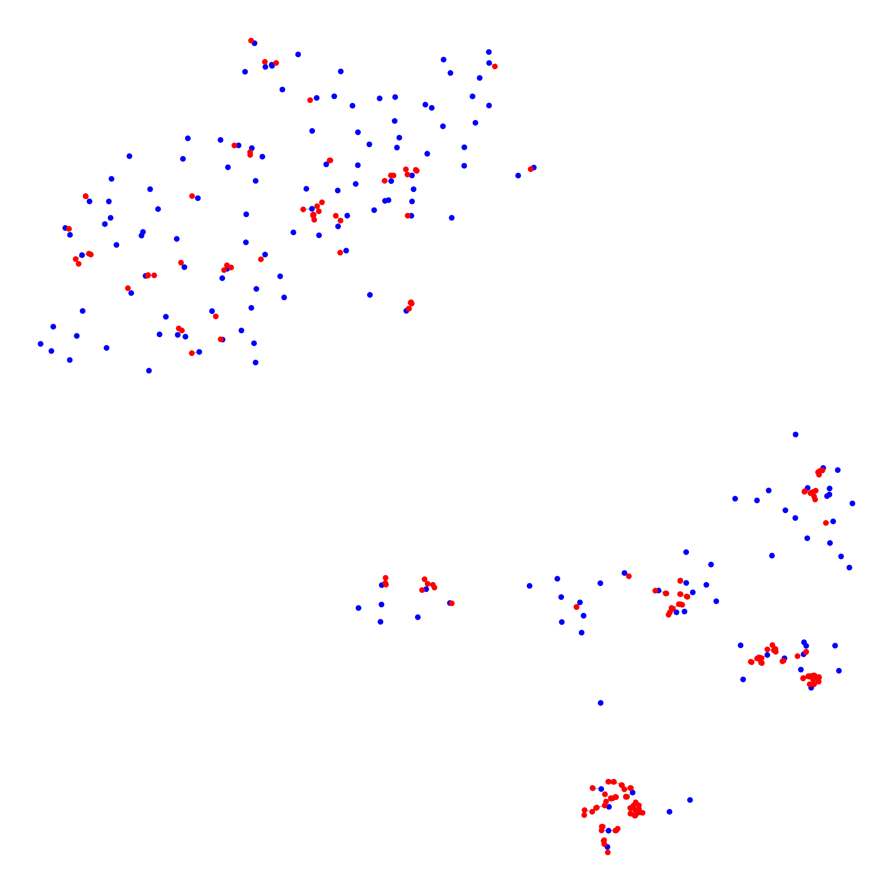

[Speedrunning](https://en.wikipedia.org/wiki/Speedrun) is pretty awesome. I've always been fascinated with learning new tricks, planning new routes, or optimizing my play just to shave those few precious seconds off my personal best time. It's competitive, challenging, and all about improvement.

Browsing through the categories for some of my favorite games, I stumbled across a somewhat peculiar category for Genshin Impact: [Defeat X Elite Enemies](https://www.speedrun.com/gi#Elite_Enemies). X can be 100, 200, 400, or even 600 enemies!

What excited me about this fairly ordinary task is just how many locations you'd have to visit on an open world map, and how we could potentially optimize this.

What's the shortest path for each number of enemies? How can we take advantage of the fact that we can teleport? Can we develop tools which would do this for us algorithmically? Finally, can we expand this idea to other routes, like farming frogs? 

Of course we can, and that's what I'd like to present to you below!

Note: If you're not interested in the data science story, skip right to the results/conclusions at the end!

## Oh, where oh where could my data be? 

A lot of Genshin Impact players will be familiar with an [interactive map](https://genshin-impact-map.appsample.com/). This is a useful tool for locating all kinds of resources. In our case, we're interested in [elite enemies](https://genshin-impact.fandom.com/wiki/Elite_Enemies).
The data for this map is stored in a marker json that is fetched on load in. This provides us with the locations of, well, everything! Neat! There's one small catch, which is of course these markers are not labeled. So we can't distinguish an elite enemy from a mint. So what are we to do? Luckily, the map accesses these markers with a unique identifier. But how to we get that info from the website? That's where webscraping comes in handy.

## Webscraping, Selenium, and some BeautifulSoup

Selenium is generally used for browser automation, but is also a very useful tool in navigating a site and extracting information from it. 
Looking at the Genshin Impact Interactive Map, several buttons can be observed which display their respective markers. By inspecting the elements of the page (F12), we can observe that the image associated with the button has an id. So our plan is to access each of those buttons, so we can map the name of the button to the id to the same id on the marker. This will provide us with the name of that marker location!



Alright, so let's get scraping!

Starting with some importing.

```python
from selenium import webdriver
from selenium.webdriver.common.by import By
# Waiting with conditions
from selenium.webdriver.support.ui import WebDriverWait
from selenium.webdriver.support import expected_conditions as EC
# Loading data into csv format
import csv
```

Here, we request the site, and all its info loaded on the page. 

The wait at the end can be very useful. There are two kinds of waits: Implicit and Explicit. Implicit is a general wait. Explicit is used for specific conditions to be met before continuing. This can be very useful to stop the bot from sprinting ahead before something useful is loaded.

```python
# Constructs Chrome Driver
driver = webdriver.Chrome(executable_path='D:/DataScience/PycharmProjects/SeleniumDrivers/chromedriver.exe')
# Requests from the url using driver
driver.get("https://genshin-impact-map.appsample.com/")
# Wait to load browser ~ implicit makes everything wait until ready
driver.implicitly_wait(5)
```

Now we grab all the images which contain a certain css styling. In this case, we want all the images which start with the link to a marker. It's nice to do this with a try catch because it will indicate if you've met a failed condition.

```python
# Create a list of img tags selected by CSS. In particular, we grab by having the src have .../markers
try:
    imgs = driver.find_elements(By.CSS_SELECTOR, 'img[src^="https://game-cdn.appsample.com/gim/markers/"]')
except:
    print("Those images weren't found. Skipping...")
```

At this point, we have all the elements stored in imgs. Now we want to access info from each of those elements and write them to a file.

```python

# open the file in the write mode
f = open('btn_mapping.csv', 'w', newline='')
# create the csv writer
writer = csv.writer(f)

# Writing a header manually
writer.writerow(["type2", "title"])

# Iterate through each img. Grab its src (o id) and alt (text)
for img in imgs:
    # Grabbing attribute data
    src = img.get_attribute("src")
    alt = img.get_attribute("alt")

    #Printing
    print(f"{src}, {alt}")

    # Writing
    writer.writerow([src, alt])

# close the file
f.close()

```

At this point, we've scraped all the info we needed off the Teyvat map. But what if we want other maps, like Enkanomiya, for example? We can actually tell Selenium to click on buttons to navigate the page!
If you're further interested in this, check out my [GitHub](https://github.com/MarcoRSousa) for additional code accomplishing this task!

For now, we got all the data we need, but it's so messy! Let's clean that up.

## Data Cleaning

First, let's look at the two data sources we need to neaten up: The markers.json, and our scraped csv file.

Markers:

```python
# Opening the json file
with open('markers.json') as json_data:
    data = json.load(json_data)

df = pd.DataFrame(data['data'], columns = data['headers'])
```

|   | id | type | mid | level | lng | lat |
| --- | --- | --- | --- | --- | --- | --- |
| 0 | 2702 | o6 | 2 | 5 | -0.04151 | 0.03910 |
| 1 | 2759 | o6 | 2 | 5 | -0.15001 | 0.08293 |
| ... | ... | ... | ... | ... | ... | ... |

Scraped Data: 

```python
# Loading in the marker data that was scraped off the site
df_mapping = pd.read_csv('btn_mapping.csv')
```

|     | type2 | title               |
| --- | ----- | ------------------- |
| 0   | https://game-cdn.appsample.com/gim/markers/o5.png    | 65 � Anemoculus    |
| 1   | https://game-cdn.appsample.com/gim/markers/o6.png    | 131 � Geoculus     |
| 2   | https://game-cdn.appsample.com/gim/markers/194.png  | 181 � Electroculus |
| 3   | https://game-cdn.appsample.com/gim/markers/141.png  | 80 � Crimson Agate |
| ... | ...   | ... |

We can immediately see that there's quite a few things that are unsatisfying about this data.
First, the entire link associated with the type id. Next, the preceding numbers in the title, along with other symbols.
Let's clean that up.

```python
# Removing the link information from id str for better merging
df_mapping['type2'] = df_mapping['type2'].str.replace('https://game-cdn.appsample.com/gim/markers/', '', regex=True)
df_mapping['type2'] = df_mapping['type2'].str.replace('.png', '', regex=True)

# Dropping duplicates
df_mapping = df_mapping.drop_duplicates(subset=['type2'])
df_mapping

# Cleaning the ASCII of the title column
# The basic idea is to replace the non ascii with a ?, then replace any ? with whitespace
df_mapping['title'] = df_mapping['title'].str.encode('ascii', 'replace').str.decode('ascii')
df_mapping['title'] = df_mapping['title'].str.replace('?',' ', regex=True)
# Left Stripping the numbers in front of some Strings
df_mapping['title'] = df_mapping['title'].str.lstrip('0123456789.- ')
```

|     | type2 | title         |
| --- | ----- | ------------- |
| 0   | o5    | Anemoculus    |
| 1   | o6    | Geoculus      |
| 2   | o194  | Electroculus  |
| 3   | o141  | Crimson Agate |
| ... | ...   | ... |

Ahh, now that's much better. Finally, let's merge this data into one neat dataframe.

```python
# Merging left. This preserves the marker data, and adds title information from df_mapping
df_clean = df.merge(df_mapping, left_on='type', right_on='type2', how='left')
```

Oh, and let's only look at Teyvat for now.

```python
# mid refers to which map we are discussing. mid=2 refers to the base Teyvat map.
# The following is only the Teyvat Map
teyvat = df_clean[df_clean['mid'] == 2]
teyvat
```

Lastly, I'm going to take out all that other uneeded stuff by only grabbing teleporters and elite enemies.

```python
teleport = teyvat[teyvat['title'].isin(['Statue of 7', 'Teleporter', 'Domain'])]
elite_enemies = teyvat[teyvat['title'].isin(['Mitachurl', 'Abyss Mage', 'Fatui Agent', 'Fatui Cicin Mage', 'Fatui Skirmisher', 'Ruin Guard', 'Ruin Hunter', 'Ruin Sentinel', 'Geovishap Hatchling', 'Geovishap', 'Fatui Mirror Maiden', 'Wolves of the Rift'])]

# Adding a status tag to differentiate between teleporting and fighting an enemy
elite_enemies['status'] = 'elite enemy'
teleport['status'] = 'teleport'

teyvat_speedrun = pd.concat([teleport, elite_enemies]).reset_index()
```
And that's the last of tedious data cleaning. Let's get routing!

## MST and Prim's (heap)

The basic idea we want is to find the minimum path between N points. In graph theory, this is called a Minimum Spanning Tree (MST). 
Generally, a MST is completely connected. However, in our case, we can teleport all over the place! To accommodate this, we can say the distance between teleporters is actually 0.

I chose to use Prim's algorithm. Its idea is very simple. The essential technique is to calculate and locate the next nearest node, and add that to visited nodes, then repeat this procedure until you've met N nodes. Greedy algorithms are generally not preferable, but I think this suits our needs quite well; given the density of the data and how this encourages the algorithm to approach from the nearest teleporter or nearby location. When something is too far, it'll simply teleport away, which is the very kind of behavior we're looking for.

Graph data is generally stored in one of two structures: A linked list or an adjacency matrix. I chose to implement a linked list.

```python
# Acquiring the points and the status from teyvat_speedrun dataframe
points = [[x,y,status] for x, y, status in zip(teyvat_speedrun['lng'], teyvat_speedrun['lat'], teyvat_speedrun['status'])]

# Number of points
N = len(points)

def euclidean_distance(x1,y1,x2,y2):
    """Euclidean distance method."""
    distance = np.sqrt((x2-x1)**2 + (y2-y1)**2)
    return distance

# Adjacency list construction using dictionary
linked = {i:[] for i in range(N)}

# Iterating through every point, calculating distance, and appending to our linked list structure
# Using range(i+1,N) only constructs upper triangular of adjacency matrix. Append creates lower.
for i in range(N):
    # Take the x,y point for item pi
    x1, y1, status1 = points[i]
    for j in range(i+1,N):
        x2, y2, status2 = points[j]

        if((status1 == 'teleport') & (status1 == status2)):
            dist = 0
            linked[i].append([dist, j])
            linked[j].append([dist, i])
        else:
            dist = euclidean_distance(x1,y1,x2,y2)
            linked[i].append([dist, j])
            linked[j].append([dist, i])
```

Finally, here's our Prim's algorithm.

```python
def prims(linked,N):
    # Variables. minHeap is populated with [[cost,point,connection],...,[]]
    # Note: Point is the newly added point. Connection is the old point its being connected to.
    distance = 0
    visited = set()
    minHeap = [[0,0,0]]
    connections = []

    # Looping until we reach all N nodes
    while(len(visited) < N):
        # heappop returns the smallest element (cost) and its associated point
        cost, point, connection = heapq.heappop(minHeap)

        if point in visited:
            continue
        # Adding a node to visited and adding distance
        distance = distance + cost
        visited.add(point)
        connections.append([connection,point])

        # Add neighbors to the minHeap using the newly added point
        for neiCost,neighbor in linked[point]:
            if neighbor not in visited:
                # Adding to the minHeap if not already in
                heapq.heappush(minHeap, [neiCost, neighbor, point])

    return connections
```

Alright, awesome! This gives us all of our edge connections for up to N points. But how can we visualize this? I choose to do this with a package called networkx.

```python
def graphRoute(connections,N):
    # Creating a network from networkx
    G = nx.Graph()
    for connection in connections:
        # Adding only included nodes
        G.add_node(connection[0])
        G.add_node(connection[1])

    # Adding edges from connections
    for connection in connections[175:]:
        G.add_edge(*connection)

    # Constructing a dictionary of points from connections
    pointsDict = {}
    for c in connections:
        pointsDict[c[0]] = [points[c[0]][0],points[c[0]][1]]
        pointsDict[c[1]] = [points[c[1]][0],points[c[1]][1]]

    # This uses the dictionary to assign fixed position for the nodes
    # node0: [position, position]
    fixed_positions = pointsDict
    fixed_nodes = pointsDict.keys()
    pos = nx.spring_layout(G, pos=fixed_positions, fixed=fixed_nodes)
    # This defines a color mapping. I want the teleporters to be blue and the enemies red
    color_map = ['blue' if node < 175 else 'red' for node in G]
    # A large figure allows the points and connections to be more distinct

    plt.figure(3, figsize=(40, 40))
    nx.draw(G, pos, with_labels=False, node_color=color_map)

```

## The Results

Now, let's put it all together! 

The blue points are points on the map we can teleport to, but don't need to visit. The red points are locations of elite enemies we need to defeat.

```python
# Another speedrunning route, only going to N points
N = 175 + 600
connections = prims(linked,N)
graphRoute(connections,N)
```


That's it? Well, yes. But let's zoom in on an area to demonstrate the connections a bit better (note, you can open the image and do this manutally).



Now we can see how this provides useful routing information much better. Also notice how it cuts out teleporter locations we don't need to use.

Furthermore, we can use this to select which locations are best to visit when N is small. Consider when N=200.



Now we can see that the algorithm selects clusters to naviage first. Furthermore, it suggest some points where the distance is so small it's worth the detour.

## Discussing Some Outcomes

I think this can be a very useful tool for informing routing decisions when there are many locations to visit. However, this does not come with some drawbakcs.
These routing decisions are not exclusive to elite enemies as well. Traversing a map to get any kind of resource can be optimized in this fashion. 

For one, this does not account for the topology of the region. The most southern Tsurumi island has lots of mountains and caves. Traversing this location may actually be slower than other less mountainous regions. 
We can actually overcome this issue if provided topological data (and x,y,z coordinates) by constructing a directed graph instead. 

Another problem is the issue of real-time teleports. If you have a slow computer, teleporting and loading may consume more time than simply going a farther distance. This issue is remedied with higher performing computers.

### But That's it!

Thank you for your interest, and keep on speeding on.