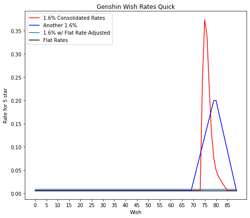

In this installment of the Genshin series, we'll be further investigating the Genshin Impact wishing system. In [part one](/blog/genshin-wishes-p1), we discussed the contradiction between having a flat rate of 0.6% to get a 5 star (with pity at 90) and having a consolidated rate of 1.6%. Turns out, the consolidted rate should be 1.435% instead!

But what if there isn't a flat rate, and instead the 1.6% consolidated is true? The following post will give a rough guess as to what those underlying rates may be.

In future posts we may improve our estimated rates with hyperparamater turning, machine learning, and optimization. However, without raw data, this may prove a redundant task, and may focus on other aspects of the so called 'soft pity' rates.

Let's get into it!

## Programming Details

I don't think the programming details are all that important in this section. Check out  <a href="https://github.com/MarcoRSousa" target="_blank">my GitHub</a> for more code. I simply carry out a bootstrap of the simulations with a rates array that are freely adjustable and see if we can artificially produce that 1.6% consolidated rate. Nonetheless, some of the code is below, but feel free to skip ahead.

Imports

```python
import numpy as np
import pandas as pd
import random
from collections import Counter
import matplotlib.pyplot as plt
```
My wishing mechanisms. I make rates an input. I also only care about 5 stars for now. I lazily use a global count5 to represent how far along pity we are.

```python
def roll(probMassFunc = [0.006,0.994]):
  """
  INPUT: probMassFunc
  OUTPUT: 0,1 (not 5 star; 5star)
  FUNCTIONALITY: Simulate 1 roll for just 5 star or not
  """

  value = np.random.choice(2,1,replace=True,p=probMassFunc)
  return value[0]
```
```python
def conditionalRoll(wishRates):
  """
  INPUT:Rates; array of shape 90,
  OUTPUT: A sommon (5 star or not)
  Dependency: Requires global count5 starting at 1 and rates array
  Functionality: Now we roll with style (just keeping track)
  """

  global count5

  if(count5 == 90):
    summon = 0
  else:
    summon = roll(probMassFunc=[wishRates[count5],1-wishRates[count5]])

  if(summon == 0):
    count5 = 1
  else:
    count5 = count5 + 1

  return (summon)
```

My bootstrap mechanism, which really just repeats above. Make sure to choose your own rates array.

```python
def bootstrap(bootstrapNum = 10, wishNum = 69000 , wishRates = rates):
  """
  INPUT: none; can adjust bootstrap and wishes and rates array
  OUTPUT: An array collecting consolidate rates of 5 stars
  """
  # How many bootstraps and how many wishes per bootstrap
  consolidated5Distribution = np.zeros(bootstrapNum)
  wishArr = np.zeros(wishNum)

  #Each bootstrap
  for stat in range(bootstrapNum):

    #Storing results
    for wish in range(wishNum):
      wishArr[wish] = conditionalRoll(wishRates)

    #Creating a dict counter of the array
    countDict = Counter(wishArr)
    
    #Calculating the consolidated rate for 5 and 4 star
    consolidated5 = countDict[0]/wishNum

    consolidated5Distribution[stat] = consolidated5

  return consolidated5Distribution

```
With this, calling bootstrap will carry out our simulation for `bootstrapNum` number of times, with each iteration having `wishNum` number of wishes. You may also define the rates as well.

```python
distribution = bootstrap(10,69000,inputRates)
distribution2 = bootstrap() #If you created an array called rates
```

## So what could the rates look like?

So here's a few rates I tried which are plotted below. Of course, I tried the flat 0.6% rates (black), and that again reproduced our 1.435%. I then tried three other methods of approximately achieving a consolidated rate of 1.6%. Simply raising the flat rate is one way to inrease the consolidated rate, which is represented by the cyan line. Another way is to mostly keep your 0.6% rates, but increase your rates at some point create a 'soft pity'. However, if you believe in a sudden soft pity at 74, for example, then the rates have to skyrocket to accomidate the consolidated rate. This is represented with the red line. A way of mending this is to make a broader curve for the rates. This is represented by the blue line.



We can significantly improve our results with some tuning and a little bit of machine learning, but that's not neccesary to discuss the big takeaway from these simulations.

## So what do these results mean about the rates?

The essential idea is to demonstrate that the rates cannot be theoretically determined without data because the solution is not unique. In particular, there are many solutions, and likewise many rates, that produce that 1.6% consolidated rate. 

In order to gain more insight on the underlying rates, we would need a sufficiently large amount of data to guide our analysis, or the rates would have to be simply disclosed. But of course, that'd ruin the fun.

Until next time; and best of luck!