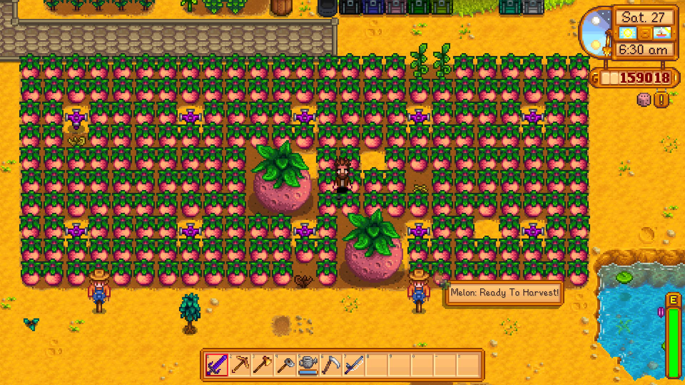
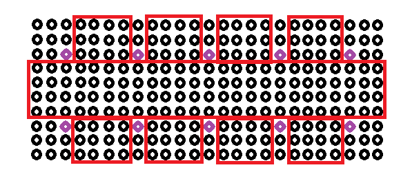

A friend of mine recently shared this with me, and revealed that each 3x3 grid has a 1% chance to merge to become the superfood you see before you. Another pal joked how lucky this was.

*So how lucky is it?*

## The Rules of The Game

So here are the rules:

1. Only plants of the same kind may merge
2. Those *other* purple things are sprinklers, and do not count for merging
3. Each 3x3 grid has a 1% chance of merging 
4. I am choosing to omit 'deformations', or what looks like dead plants and such

You may want to pause here and try it out yourself, but for those of you who want to enjoy the show, let's get to it!

## The Game Plan

If we know how many 3x3 squares there are, then we know how many 1% chances we have, which is simply like flipping a really unfair coin many times. So we can break this down into two steps

1. Calculate how many 3x3 squares
2. Calculate the chance by a Binomial Distribution

## A game of rectangles and squares

Immediately, one may notice how 3x3 squares *overlap*, but how many? There's quite a few ways to think about this.

Here's two things to help when thinking about these sorts of things. We don't need to always think in two dimensions, instead, we can start simply in one dimension. Another is the tricky relationship between points and intervals. Five points produces four intervals between them, and this is an offset of one, for a 'interval size' of one.

So let's continue with that idea in a single direction. For m points, there are m-1 intervals of size 1. What about intervals of size 2, 3, 4, and so on? With things like these, I like to try some to get a feel for the pattern at hand. You may want to try some yourself.

There are several patterns that could be produced to solve the underlying relationship. I chose to look at the # of points in a subinterval (one more than the 'interval size'), and the # of subintervals respectively produced, which got me to my answer quickly. If you choose something else, you may have to determine an equation for the sequence.

| # Interval Points | # of Intervals |
| ---------------- | --------------- |
| 2                | m-1             |
| 3                | m-2             |
| 4                | m-3             |
| 5                | m-4             |
| 6                | m-(6-1)         |
| ...              | ...             |
| k                | m-(k-1)         |

There's an obvious pattern here. If you have m points, and k points for your sub interval, then you will have m-(k-1) subIntervals, or m+1-k. If you did the same but with 'interval size' for k*, then you will simply have m-k*.

To go to higher dimensions, simply multiply. This is like multiplying sides of a rectangle to get its content area. So for a rectangle A mxn, and sub-rectangle, for dimensions smaller or equal to its larger container, with dimensions (number of points) $k_1,k_2$, then the number of sub-rectangles are:

$(m+1-k_1)(n+1-k_2)$

## There is another

The prior solution can be generalized for many alike problems, even more complex ones, simply by determining the underlying sequence. However, it's not always an explanatory solution. The following is.

We may also recognize that this resembles a convolution in image processing. In this way, we superimpose an image with an mxm square, and perform some operations for each square (let's assume valid padding). If we convolve with a 1x1 square, then there's no additional space created when iterating over the larger image. We're iterating over every pixel. If we have a 2x2 square, then there's one additional space in each direction, 3x3 two additional spaces, and so on. This produces our m-k effect. However, we must add one, because of the interaction between points and intervals. We're asking how many squares of 3x3 are produced, but that 3x3 square contains 2 intervals in each direction, which is really the 'space' it occupies, and so we need to add one to correct for such.

So, similarly, for image A of size mxn, and smaller square B of kxk, the the number of squares B will be:

((m+1)-k)((n+1)-k)

## So How Many Squares Do We Have?

Separating them into partitions looks something like this:

The primary partition is 25x4. So:

(25+1-3)(4+1-3) = (23)(2) = 46

The smaller partitions are each 4x3. We immediately see this is 2, but by formula:

(4+1-3)(3+1-3)=(2)

However, we need to account for the overlap towards the middle, which includes an additional 4 squares. Since there is 1 primary partition and 8 subpartitions:

(1)(46)+(8)(2+4) = 46+48= **94 3x3 squares**

## Binomial Distributions and Solutions

Since we now know how many squares there are, and each one is either success or failure, then this is nearly a binomial distribution. The pmf of this random variable is as follows below:

$$
P(x = X) = {n \choose k}p^{k}q^{n-k}
$$

where
- n are the number of trials
- k is the number of successes
- p is the probability for success
- q = (1-p)

The essential idea is you multiply n choose x, which represents the number of ways to get x successes, and what follows, which is the probability for each way of k successes.

Following this formula, with p=0.01, q=1-p, n=94 trials, and k=1 success:

P(x=1) = 0.369148

p(x>1) = 0.242067

Thus, the probability of getting exactly 1 merge in 94 trials is roughly 36%, and getting 1 or more merge is as high as 61.12%! That's pretty common!

So it turns out that 1% can be pretty tricky. However, the truth is that they are not completely independent, since if one 3x3 merges, another one with any overlap cannot merge. So this is only exact for P(x <= 1), although a very good approximation.

This was a fairly lengthy read, and if you actually made it through, wow! Thank you so much, and I hope to catch you in the next post.